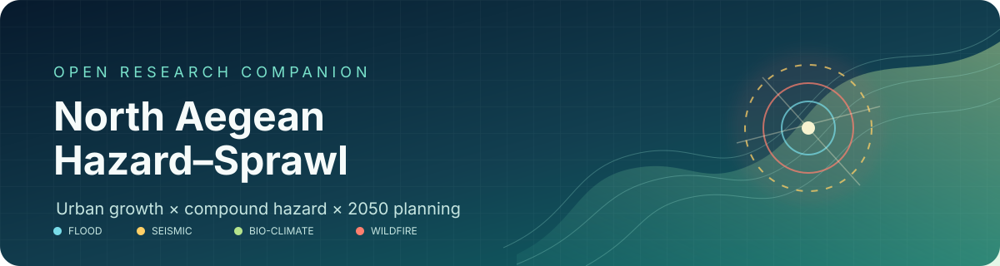
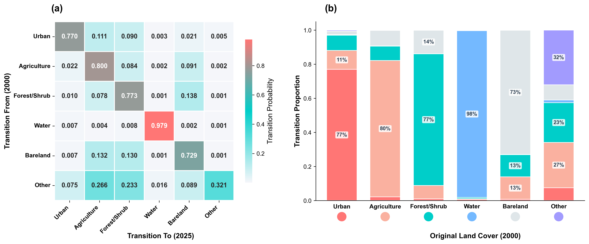
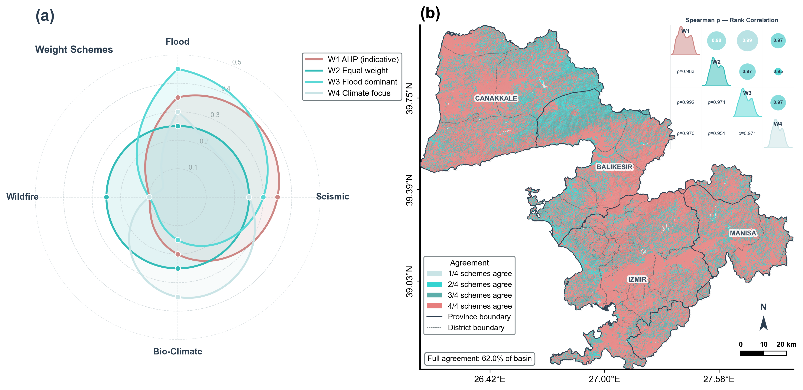
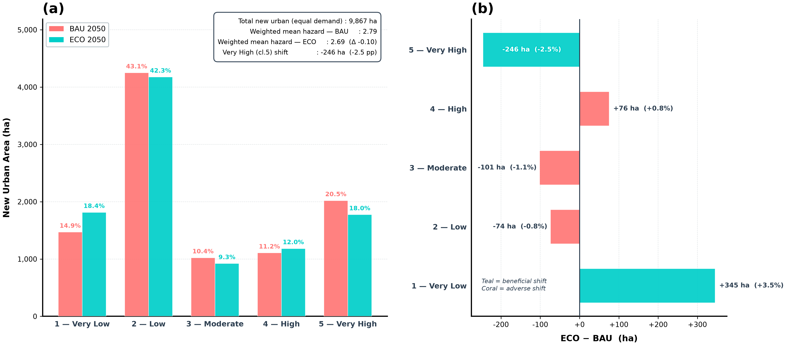
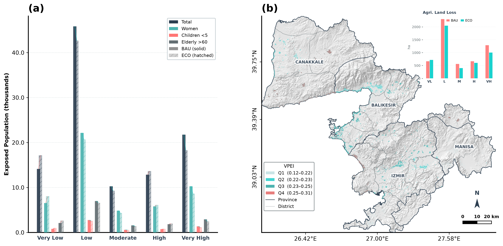

  

  
  
  
  
  

# Future spatial footprints of natural hazards

This is the open research companion to a study of how urban expansion may intersect flood, seismic, bio-climatic, and wildfire hazard across the North Aegean Basin, Türkiye. It connects a 37-year land-cover record to an RF–FLUS-style cellular automaton, tests two demand-equivalent 2050 planning scenarios, and turns the resulting exposure patterns into planning-ready evidence.

> The manuscript is under review at Urban Climate. No article DOI has been assigned. This repository contains code, author-created figures, and compact parameter tables—not the manuscript, publisher PDF, or third-party geospatial data.

<table>
  <tr>
    <td align="center"><strong>+312.5%</strong> urban footprint, 1985–2022</td>
    <td align="center"><strong>31.7%</strong> BAU growth in high / very-high hazard</td>
    <td align="center"><strong>5.4%</strong> ECO exposure reduction ratio</td>
    <td align="center"><strong>0.820</strong> flood validation ROC AUC</td>
    <td align="center"><strong>ρ ≥ 0.960</strong> cross-scheme spatial robustness</td>
  </tr>
</table>

  

## Why this repository matters

The scientific contribution is not another single-hazard map. It is the explicit coupling of observed urbanisation, forward land allocation, independently constructed hazard components, and demographic/agricultural asset exposure on one harmonised 30 m grid.

- Historical urban land increased from 5,814.81 ha to 23,988.24 ha.
- BAU allocates 3,126 ha of projected new growth to high or very-high hazard zones.
- ECO redirects 170 ha of the most exposed growth, yet 30.0% remains in high-hazard corridors.
- Jenks natural breaks replace fixed quintiles, so the high-hazard share is learned from the surface.
- AHP, equal, rank-based, and PCA-derived fusion schemes remain strongly concordant.
- GFD validation uses threshold-independent ROC AUC and reports the maximum-CSI operating point separately.

## The analytical chain

~~~mermaid
flowchart LR
    A["1985–2022 LULC + 11 spatial drivers"] --> B["RF urban suitability"]
    B --> C{"Seeded CA same 2050 demand"}
    C --> D["BAU"]
    C --> E["ECO"]
    F["Flood"] --> J["AHP fusion + Jenks classes"]
    G["Seismic"] --> J
    H["Bio-climate"] --> J
    I["Wildfire"] --> J
    D --> K["Spatial exposure intersection"]
    E --> K
    J --> K
    K --> L["No-build · TDR · NbS planning priorities"]
~~~

Method details are documented in [docs/methods.md](docs/methods.md), with the exact fusion matrix and published weight vectors in [docs/ahp_matrices.md](docs/ahp_matrices.md).

## Reproduce the workflow

The fastest local setup uses Conda/Mamba:

~~~bash
git clone https://github.com/YOUR-ORG/north-aegean-hazard-sprawl.git
cd north-aegean-hazard-sprawl
mamba env create -f environment.yml
mamba activate north-aegean-hazard-sprawl
python scripts/verify_ahp.py
python scripts/publication_audit.py
~~~

For Earth Engine exports, copy <code>.env.example</code> to your own untracked environment configuration and set <code>EE_PROJECT</code>, <code>GEE_DRIVE_FOLDER</code>, and either <code>EE_ROI_ASSET</code> or a local boundary GeoJSON. Then follow the staged recipe in [docs/reproducibility.md](docs/reproducibility.md).

Third-party rasters are deliberately absent. [docs/data_sources.md](docs/data_sources.md) links each provider and records the redistribution boundary.

## Repository map

~~~text
north-aegean-hazard-sprawl/
├── src/                    analysis, GEE export, validation, and figure code
├── data/ahp/               versioned author-created weights and fusion matrix
├── figures/png/            ten final author-generated figures
├── scripts/                AHP verification and pre-publication audit
├── docs/                   methods, provenance, reproducibility, project site
├── CITATION.cff            software and preferred article citation metadata
├── environment.yml         geospatial Conda environment
└── requirements.txt        pinned Python environment
~~~

## Visual atlas

| Urban dynamics | 2050 scenarios |
|---|---|
|  |  |

| Multi-hazard convergence | Weight sensitivity |
|---|---|
|  |  |

| Exposure intersection | Demographic exposure |
|---|---|
|  |  |

## Reproducibility boundary

This repository makes the analysis logic inspectable, but it cannot legally or responsibly mirror every provider raster. Reproduction therefore has two levels:

1. Code-level reproduction: environment, AHP verification, workflow order, parameters, and authored figures are complete here.
2. Data-level rerun: users obtain the listed datasets under their original terms, authenticate with their own Earth Engine account, and populate ignored staging directories.

The only full pairwise matrix released here is the four-component fusion matrix available in the archived revision package. Sub-component final weights and reported consistency ratios are included without reverse-engineering absent judgement matrices. See [docs/ahp_matrices.md](docs/ahp_matrices.md).

## Citation

Use the repository’s “Cite this repository” control, powered by [CITATION.cff](CITATION.cff). Until the article is accepted, please treat the preferred article metadata as “under review” and do not invent a DOI.

## Licence and attribution

Code is MIT licensed. Documentation and author-generated figures are CC BY 4.0. Input datasets retain their providers’ terms and are not redistributed. See [NOTICE.md](NOTICE.md) and [docs/data_sources.md](docs/data_sources.md).

Created by Yusuf Eminoğlu and Kemal Mert Çubukçu at Dokuz Eylül University / LUQAA.
